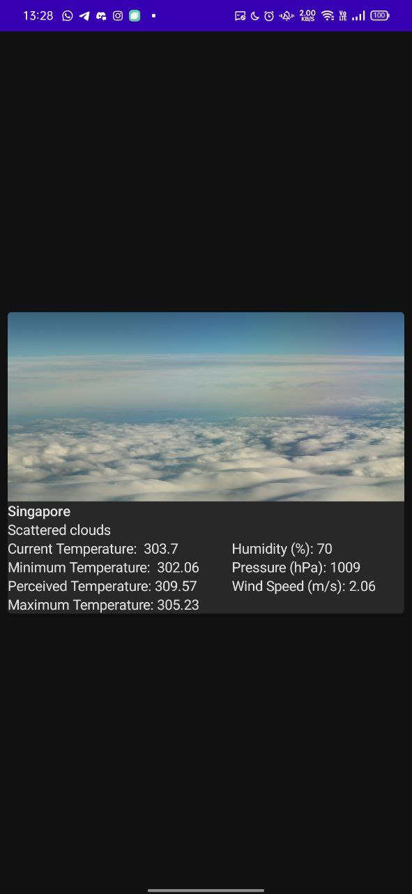

# Application

The purpose of this assignment is to create a simple App to display the current weather forecast using the OpenWeatherMap free weather API.  Details of this API can be found at http://openweathermap.org/API.   You will need an API key to request this data.

# Objectives
- Create a simple App that displays the current weather forecast for your device current location, and display location and all relevant information received in the response in a card view.

- Send a HTTP request to the OpenWeatherMap API to retrieve the current local weather forecast and parse the response.
- Save the response so that on next application startup or in no internet case saved data is showed first with time mentioning when this data was received and along with that network call should also happen in the background to get the latest weather data.
